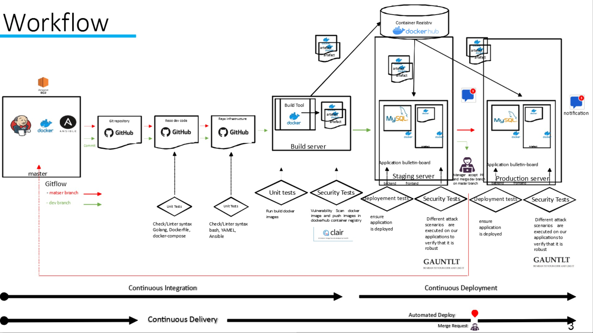

# BADGE

## Description

This repository is used to demonstrate how to use Jenkinsfile to build pipeline for bulletin-boar app

### ci-cd-bulletin-board avec jenkins

chaine d'integration de bulletin-board avec jenkins.

test unitaire du code de l'application

test iac (markdown-yaml-docker-compose-playbook)

scan artefact (clair)

deploiement

check de deploiement

test securité avec gauntl

utilisation d'une shared library et notification slack

